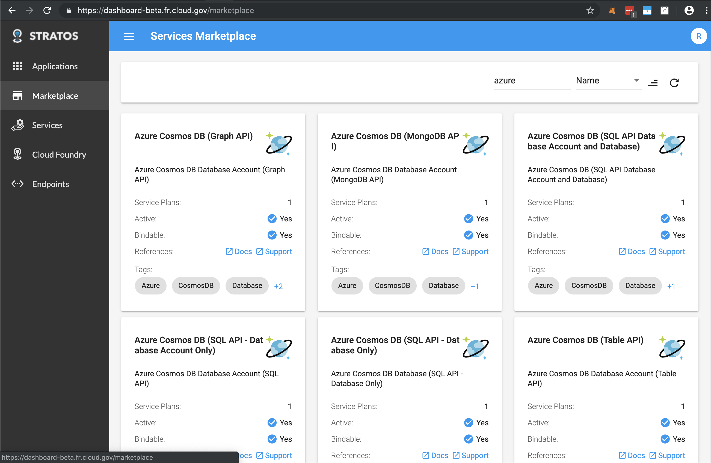
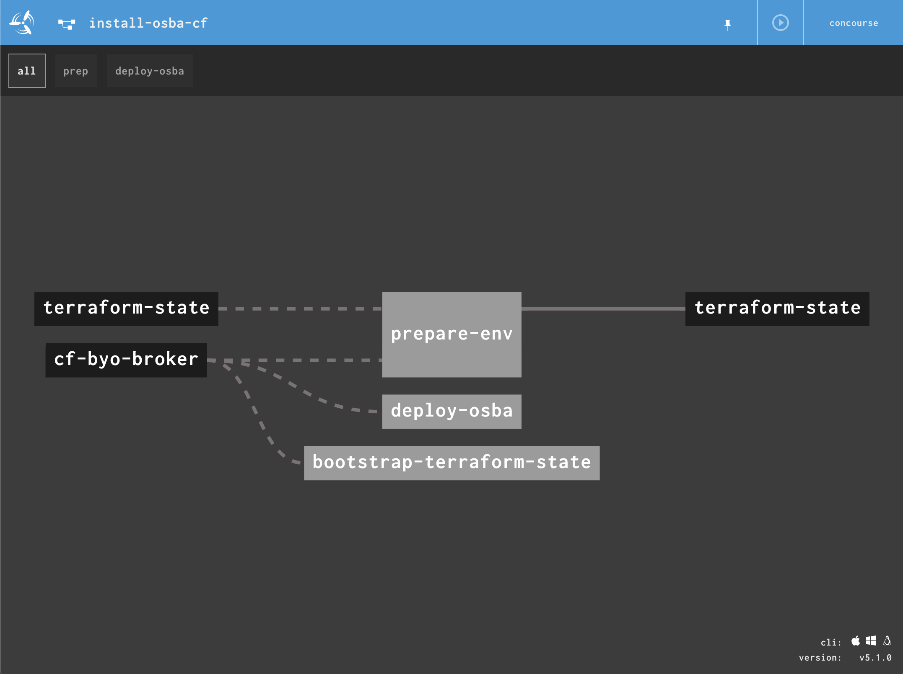

# Open Service Broker™ for Azure on Cloud Foundry

This tutorial walks us through how to steps required to deploy the Azure open service broker (OSBA) to a scoped space on Cloud Foundry. We will also illustrate leveraging `terraform` and Concourse.ci pipelines, outlining how to deploy the Azure open service broker (OBSA) both manually and programmatically.

**Table of Contents**

* [Prerequisites](#prerequisites)
* [Azure Quickstart](#azure-setup)
    * [Configure your Azure account](#configure-your-azure-account)
    * [Create a Resource Group](#create-a-resource-group-for-aks)
    * [Create a service principal](#create-a-service-principal)
* [Deploying the Broker](#deploying-the-broker)
    * [Cloning](#cloning)
    * [Configuring](#configuring)
    * [Pushing]()
    * [Registering]()
        * [Viewing the Marketplace](#viewing-the-marketplace)
* [Automation](#automation)
    * [Working Assumptions](#working-assumptions)
    * [Automating Deployment](#automating-deployment)
        * [Usage](#usage)
        * [CI Pipelines](#ci-pipelines)
        * [Using Concourse.ci](#using-concourse.ci)
        * [Using terraform CLI](#using-terraform-cli)

    

## Prerequisites

In order to complete the tutorial, please be sure you have:

* A [Microsoft Azure account](https://portal.azure.com).
* A working knowledge of **Azure [CLI](https://docs.microsoft.com/en-us/cli/azure/install-azure-cli?view=azure-cli-latest)** or use of the [Azure Cloud Shell](https://docs.microsoft.com/en-us/azure/cloud-shell/overview?view=azure-cli-latest)
    * _Optionally, you use the official [`azure-cli`](https://hub.docker.com/r/microsoft/azure-cli/dockerfile) container_
* A working knowledge of **Cloud Foundry** with experience using the [CLI](https://docs.cloudfoundry.org/cf-cli/).
* A working knowledge of space-scoped service brokers. For an  introduction, see the [Simple Service Broker Quickstart Tutorial](../simple-service-broker).
* A Cloud Foundry account and a space to deploy apps.

## Azure Setup

### Configure your Azure account

First let's identify your Azure subscription and save it for later use.

1. Run `az login` and follow the instructions in the command output to authorize `az` to use your account
1. List your Azure subscriptions:
    ```console
    az account list -o table
    ```
1. Copy your subscription ID and save it in an environment variable:

    **Bash**
    ```console
    export AZURE_SUBSCRIPTION_ID="<SubscriptionId>"
    ```

    **PowerShell**
    ```console
    $env:AZURE_SUBSCRIPTION_ID = "<SubscriptionId>"
    ```

    **Optionally, if you have Docker installed** 

    ```sh
    docker run -it --rm \
            -v $(pwd):/root/.kube \
            microsoft/azure-cli
    ```

### Create a Resource Group

Create one with the az cli using the following command.

```console
az group create --name <CHANGEME> --location eastus
```

### Create a service principal

Service Principals are security identities within an Azure AD tenancy that may be used by apps, services and automation tools.

When you create a Service Principal then from an RBAC perspective it will, by default, have the Contributor role assigned at the subscription scope level. For most applications you would remove that and then assign a more limited RBAC role and scope assignment, but this default level is ideal for Terraform provisioning.

Open Service Broker for Azure uses a service principal to provision Azure resources on your behalf or if you're using AKS, on behalf of Kubernetes.

1. Create a service principal with RBAC enabled:
    ```console
    az ad sp create-for-rbac --name osba -o table
    ```
1. Save the values from the command output in environment variables:

    **Bash**
    ```console
    export AZURE_TENANT_ID=<Tenant>
    export AZURE_CLIENT_ID=<AppId>
    export AZURE_CLIENT_SECRET=<Password>
    ```

    **PowerShell**
    ```console
    $env:AZURE_TENANT_ID = "<Tenant>"
    $env:AZURE_CLIENT_ID = "<AppId>"
    $env:AZURE_CLIENT_SECRET = "<Password>"
    ```

## Deploying the Broker

### Cloning

> We will start by cloning the latest broker source from [OSBA](https://github.com/Azure/open-service-broker-azure)'s offfcial github repository. If you don't have `git` installed, you can also download a zip file of the broker source.


  ```sh
  $ git clone https://github.com/Azure/open-service-broker-azure.git
  ```
  ```sh
  $ cd open-service-broker-azure  
    .
    ├── Dockerfile
    ├── Gopkg.lock
    ├── Gopkg.toml
    ├── LICENSE
    ├── Makefile
    ├── README.md
    ├── cmd
    │   ├── broker
    │   └── compliance-test-broker
    ├── contrib
    │   ├── cf
    │   │   ├── README.md
    │   │   ├── manifest.yml
    │   │   └── pcf-tile
    │   ├── ...
    ├── ...
```

### Configuring

Let's edit our manifest at `contrib/cf/manifest.yml` and enter the values obtained in the earlier steps:

> _In later steps, we show how to automate this step and generate our `manifest.yml` using create-storage-provider.sh interactive script under `/scripts`_

```yaml
---
  applications:
    - name: osba
      buildpack: 
        - go_buildpack
      command: broker
      env:
        AZURE_SUBSCRIPTION_ID: <YOUR SUBSCRIPTION ID>
        AZURE_TENANT_ID: <TENANT ID FROM SERVICE PRINCIPAL>
        AZURE_CLIENT_ID: <APPID FROM SERVICE PRINCIPAL>
        AZURE_CLIENT_SECRET: <PASSWORD FROM SERVICE PRINCIPAL>
        LOG_LEVEL: DEBUG
        MIN_STABILITY: PREVIEW
        ENABLE_MIGRATION_SERVICES: false
        REDIS_PREFIX:
        STORAGE_REDIS_HOST: <HOSTNAME FROM AZURE REDIS CACHE>
        STORAGE_REDIS_PASSWORD: <PRIMARYKEY FROM AZURE REDIS CACHE>
        STORAGE_REDIS_PORT: 6380
        STORAGE_REDIS_DB: 0
        STORAGE_REDIS_ENABLE_TLS: true
        CRYPTO_ENCRYPTION_SCHEME: AES256
        CRYPTO_AES256_KEY: AES256Key-32Characters1234567890
        ASYNC_REDIS_HOST: <HOSTNAME FROM AZURE REDIS CACHE>
        ASYNC_REDIS_PASSWORD: <PRIMARYKEY FROM AZURE REDIS CACHE>
        ASYNC_REDIS_PORT: 6380
        ASYNC_REDIS_DB: 1
        ASYNC_REDIS_ENABLE_TLS: true
        BASIC_AUTH_USERNAME: username
        BASIC_AUTH_PASSWORD: password
        GOPACKAGENAME: github.com/Azure/open-service-broker-azure
        GO_INSTALL_PACKAGE_SPEC: github.com/Azure/open-service-broker-azure/cmd/broker
```

_**Info**: In a production environment, we would recommend using CREDHUB to store these values._

### Pushing

Once you have added the necessary environment variables to the CF manifest, you can simply push the broker:

```console
cf push -f contrib/cf/manifest.yml
```

### Registering

Now that our broker is available as an app, we can register it with Cloud Foundry.

* Register your broker using `cf create-service-broker`:

  ```sh
  $ cf csb open-service-broker-azure  <username> <password> https://<route> --space-scoped
  ```

### Viewing the Marketplace

At this point, your new service broker called `open-service-broker-azure` should show up in the marketplace along side the other services.

> NOTE: Because this is a space-scoped broker, OSBA will only show up in the marketplace in the space or spaces which it is registered.

* Run `cf marketplace` using the CLI. Within the marketplace, you should see a large number of service offerings prefixed by `azure-` which are advertised by the broker

#### Stratos Console 

If you're running the [Stratos UI](https://github.com/cloudfoundry-incubator/stratos) for Cloud Foundry



## Automation

### Working Assumptions
* An instance of Concourse installed up-and-running, including
use of [`fly` CLI](https://concourse-ci.org/fly.html).
    * _depending on where you've installed Concourse, you may need to set up additional firewall rules to allow Concourse to reach
    third-party sources of pipeline dependencies_
* A working knowledge of [Concourse.ci](https://concourse-ci.org) and 
* An working knowledge of [terraform](https://portal.azure.com) and use of [terraform providers](https://www.terraform.io/docs/providers/)
## Automating Deployment

### Usage
Create an Azure Storage Account and Container to store our `terraform.tfstate`, required by our `init-terraform-state` pipeline job

> NOTE: Here, we show how to automate this step and generate our `manifest.yml` using create-storage-cache.sh interactive script under `/scripts`

### Create Redis Cache

```sh
$ az redis create -n <unique-cache-name> \
  -g <resource group> \
  -l <region> \
  --sku Standard \
  --vm-size C1
```

### Create Azure Storage

```sh
$ az group create --name "<name>" \
  --location "<region>"
```
```sh
$ az storage account create --name "<name>" \
  --resource-group "<resource group>" \
  --location "<region>" \
  --sku "Standard_LRS"
```

```sh
$ az storage container create --name terraformstate --account-name 18fci
```
### Get Keys

```sh
$ AZURE_STORAGE_ACCOUNT_KEY=$(az storage account keys list --account-name 18fci --resource-group 18F | jq -r .[0].value)

$ AZURE_REDIS_PRIMARY_KEY=$(az redis list-keys -n 18f-osba-cache -g 18F | jq -r .primaryKey)
```

### CI Pipelines

> _The pipeline(s) we'll be using are maintained in this same repostory. If you haven't already, let's clone this repository [cf-byo-broker](https://github.com/18F/cf-byo-broker) containing all the artifacts required._

  ```sh
  $ git clone https://github.com/18F/cf-byo-broker.git
  ```

  Change directory to `cf-byo-broker\azure-service-broker`

```
.
├── azure-service-broker
│   ├── README.md
│   ├── ci
│   │   └── pipeline.yml
│   ├── scripts
│   │   ├── create-service-principal.sh
│   │   └── service-principle-login.sh
│   └── terraformation
│       ├── main.tf
│       ├── outputs.tf
│       └── variables.tf
└── ...
```
## Using Concourse.ci

> Log into concourse and set the pipeline

  ```sh
  $ fly -t bosh-lite login --concourse-url http://192.168.100.4:8080
  ```

  ```sh
  $ fly -t bosh-lite set-pipeline -p install-osba-cf \
    -c azure-service-broker/ci/pipeline.yml \
    -l azure-service-broker/ci/params.yml
  ```



## Using `terraform` CLI

Change directory to `cf-byo-broker\azure-service-broker\terraformation`

```
.
├── LICENSE.md
├── azure-service-broker
│   ├── ...
│   └── terraformation
│       ├── main.tf
│       ├── outputs.tf
│       └── variables.tf
└── ...
```

> _**Note**: Please make sure you have created the `terraform.tfvars` file as mentioned._

```bash
terraform get
terraform init
terraform plan -out=plan
terraform apply plan
```

#### Tearing down environment

>**Note:** This will only destroy resources deployed by Terraform. 

```bash
terraform destroy
```

