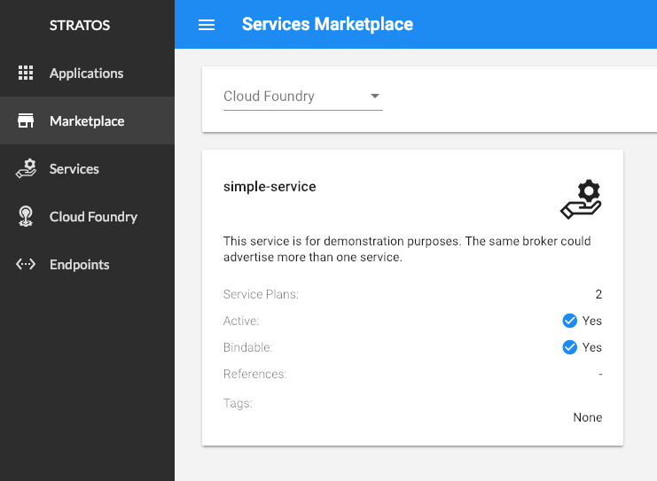

# Adding a Simple Service Broker to Cloud Foundry

In this tutorial, we will show you how to deploy a simple service broker to a space in Cloud Foundry and make it available for use via the marketplace.

Before you begin, please be sure you are logged into a Cloud Foundry instance and targeted to an org and space.

## What is a Service Broker?

A service broker is an application that implements a standard API, the [Open Service Broker API](https://www.openservicebrokerapi.org/). Service brokers hide the complexity of provisioning and configuring the underlying service behind a standard API. In Cloud Foundry terms, this means you can do things like create a database using a standard command `cf create-service`, rather than needing to know how to install and configure the database.

Service brokers are behind all of the services listed in the marketplace. In this tutorial, we will show you how add your own service broker to the marketplace. The services you see in the marketplace now are likely installed and configured by the administrators of your Cloud Foundry. However, if you are SpaceDeveloper, you can bring your own space scoped broker. This tutorial will show you how to do this.

## Deploying a Service Broker as an App

A service broker is an application that implements a RESTful API, the [Open Service Broker API](https://www.openservicebrokerapi.org/). Brokers can be deployed anywhere as long as the Cloud Foundry instance (specifically the Cloud Controller) can reach it via HTTPS. Because our broker is a stateless app and Cloud Foundry is the best platform for stateless apps, we will deploy our broker as an app to Cloud Foundry.

* Download the [simple-service-broker.zip](http://18f.artifacts.rscale.io.s3-website-us-west-2.amazonaws.com/simple-service-broker.zip) and unzip it. Change to the unzipped `simple-service-broker` directory. Inside is a very simple service broker written in Go along with a Cloud Foundry manifest.

* Change to the unzipped directory and use the supplied manifest to deploy the application. We can add the `--random-route` flag to push command to try to prevent route collisions.

  ```
  $ cf push --random-route
  ```

  If everything is successful you should see output similar to:

  ```
  name:              simple-service-broker
  requested state:   started
  routes:            simple-service-broker-humble-wallaby.cfapps.io
  last uploaded:     Mon 14 Jan 12:51:03 MST 2019
  stack:             cflinuxfs2
  buildpacks:        go

  type:            web
  instances:       1/1
  memory usage:    128M
  start command:   ./bin/simple-service-broker
       state     since                  cpu    memory          disk           details
  #0   running   2019-01-14T19:51:09Z   0.0%   11.2M of 128M   9.3M of 256M   
  ```

* Make note of the route created as you will need this in the next step. In the above example it is `simple-service-broker-humble-wallaby.cfapps.io`. Your route will differ.

> Note: We are using `random-route` to help prevent route collisions.  You should not use this feature except in development, training or CI/CD scenarios such as this. We do not recommend using `random-route` in production.

### Checking Your Work

You can verify the broker application is running with `cf apps`. You should see output similar to:

  ```
  name                    requested state   instances   memory   disk   urls
  simple-service-broker   started           1/1         128M     256M   simple-service-broker-humble-wallaby.cfapps.io
  ```

#### OPTIONAL: Accessing the Catalog

OPTIONAL: If you have `curl` (or another REST client) installed, you can access the broker's catalog via the `/v2/catalog` endpoint. This is the same endpoint used to populate the marketplace.

* You can curl your endpoint using `curl -s -u admin -H "X-Broker-API-Version: 2.14" https://<YOUR-BROKER-ROUTE>/v2/catalog`.  You will see output similar to:

  ```
  {
    "services": [
      {
        "id": "simple-service",
        "name": "simple-service",
        "description": "This service is for demonstration purposes. The same broker could advertise more than one service.",
        "bindable": true,
        "plan_updateable": false,
        "plans": [
          {
            "id": "simple-service-plan-1",
            "name": "simple-service-plan-1",
            "description": "This is plan. Plans can be used to create tiers or levels of service. For example, plans could be used to provide different amounts of cpu, memory, capacity, number of concurrent connections, network performance, etc.",
            "free": true,
            "bindable": true
          },
          {
            "id": "simple-service-plan-2",
            "name": "simple-service-plan-2",
            "description": "This is another plan. Perhaps the service instance created according this plan has more capacity or capability than simple-service-plan-1.",
            "free": true,
            "bindable": true
          }
        ],
        "metadata": {
          "displayName": "simple-service"
        }
      }
    ]
  }
  ```

Let's break down the request:

* Service Brokers in Cloud Foundry are protected by basic authentication (i.e. they require a username and password to be supplied). This broker has a default username of `admin` and password of `secret`.
  * The `-u` flag allows you to specify the username which in our case is `admin`.
  * The `-s` flag asks `curl` to prompt you for a password. `curl` does allow you to specify the password as part of the command. However if you used that flag, the password would end up in your terminal history. It is best to get in the habit of not putting passwords into commands.
* The `-H` flag allows you to specify a header and value.  The `X-Broker-API-Version` header must also be sent with the request. The value of this header is the version of the Open Service Broker API this broker supports. This is so the platform (like our Cloud Foundry instance) can verify it supports the version of the broker (in our case version `2.14`).

You will see this broker exposes a single service called `simple-service` which offers two plans (or tiers) `simple-plan-1` and `simple-plan-2`. More on this later.

> NOTE: `jq` (https://stedolan.github.io/jq/) is a very helpful utility that can parse and format JSON output. To view the output of our curl request in a more human friendly format, you can pipe the output of the `curl` into `jq`: `curl -s -u admin -H "X-Broker-API-Version: 2.14" https://<YOUR-BROKER-ROUTE>/v2/catalog | jq`

## Registering a Space Scoped Broker

Once the broker application is running, we can register it as a service broker with Cloud Foundry. If you are a Cloud Foundry admin, you can register a broker and make it available system wide. These brokers are referred to as `standard brokers`. However, if you aren't an admin you can still register a broker within a space provided you have the `SpaceDeveloper` role. These brokers are referred to as `space scoped brokers`

> More information on roles in Cloud Foundry is availble here: https://docs.cloudfoundry.org/concepts/roles.html.

* Use the `create-service-broker` command to register your broker with Cloud Foundry.

  ```
  $ cf create-service-broker simple-service-broker admin secret https://<YOUR-BROKER-ROUTE> --space-scoped
  ```

  You should see output similar to:

  ```
  Creating service broker simple-service-broker in org 18f / space simple-service-broker-integration as sgreenberg@rscale.io...
  OK
  ```

Let's break down the command:

  * `simple-service-broker`: This is the name of the broker as referenced within Cloud Foundry. While this matches our app name, there is no relationship between the two values. Using the same name simply makes it easier for humans to reason over the relationship.
  * `admin` and `secret` are the `USERNAME` & `PASSWORD` for the service broker. Providing these allows Cloud Foundry to authenticate to the broker.
  * `https://<YOUR-BROKER-ROUTE>`: This is the route of your broker prefixed with `https://`.
  * `--space-scoped`: This tells Cloud Foundry to register the broker only within your space. This allows you to add any broker to your space.

### Checking Your Work

At this point, your broker should be registered with Cloud Foundry.  You can check this by running via the `cf service-brokers` command.  You should see output similar to:

  ```
  Getting service brokers as sgreenberg@rscale.io...

  name            url
  simple-service-broker   https://simple-service-broker-humble-wallaby.cfapps.io
  ```

## Viewing the Marketplace

At this point, your new service called `simple-service` should show up in the marketplace along side the other services.

> NOTE: Because this is a space scoped broker, it will only show up in the marketplace in the space or spaces which it is registered. 

### Viewing the Marketplace in the CLI

You can see this via the CLI or using the Stratos UI.

* Run `cf marketplace` using the CLI. Within the marketplace, you should see your broker:

  ```
  $ cf marketplace
  Getting services from marketplace in org 18f / space development as sgreenberg@rscale.io...
  OK

  service                         plans

  simple-service                simple-service-plan-1, simple-service-plan-2

  ```

> NOTE: You are seeing the same service and plans as you saw accessing the broker via `curl` above (if you completed that optional portion of the tutorial). This information is populated from the same `/v2/catalog` endpoint.  

### Viewing the Marketplace in the Stratos UI

You should also see your service listed in the Stratos UI.

* Open your Stratos console and navigate to the marketplace. Be sure you have selected your org and space.  You should see the `simple-service` listed.




## Beyond the Simple Service Broker

At this point, you should be able to create and bind service instances as with any other service in the marketplace. Of course our simple broker isn't really brokering anything as there is no backing service. Therefore our instances aren't terribly useful. But we can use them to practice a few things.

While our broker is quite simple, other brokers will bring their own complexity. This is often because each broker will often require specific configuration to connect with the backing services. We can use the simple broker to learn some helpful hints on dealing with more complex brokers.

### Creating and Binding an Instance

First, let's create a service instance.  

* Use `cf create-service` to create a service instance.

  ```
  $ cf create-service simple-service simple-service-plan-1 simple-service-instance
  Creating service instance simple-service-instance in org 18f / space simple-service-broker-integration as sgreenberg@rscale.io...
  OK
  ```

* We can also use `cf services` to verify we have created an instance:

  ```
  $ cf services
  Getting services in org 18f / space simple-service-broker-integration as sgreenberg@rscale.io...

  name                      service          plan                    bound apps   last operation
  simple-service-instance   simple-service   simple-service-plan-1                create succeeded
  ```

Now, let's bind it. We aren't looking to use the service, so it doesn't matter what app we bind it to. Therefore, rather than deploy another app, we can bind it to the app we have: the simple-service-broker.

* Use `cf bind-service` to bind the instance to the simple-service-broker.

  ```
  $ cf bind-service simple-service-broker simple-service-instance
  ```

  While the CLI will prompt you to restage the app, you don't need to do this since the app won't do anything with the service.

* You can optionally see the credentials returned by the simple-service-broker by inspecting the `VCAP_SERVICES` environment variable:

  ```
  $ cf env simple-service-broker
  Getting env variables for app simple-service-broker in org 18f / space simple-service-broker-integration as sgreenberg@rscale.io...
  OK

  System-Provided:
  {
   "VCAP_SERVICES": {
    "simple-service": [
     {
      "binding_name": null,
      "credentials": "{\"url\": \"https://simple-service.example.com\"}",
      "instance_name": "simple-service-instance",
      "label": "simple-service",
      "name": "simple-service-instance",
      "plan": "simple-service-plan-1",
      "provider": null,
      "syslog_drain_url": null,
      "tags": [],
      "volume_mounts": []
     }
    ]
   }
  }
  ```

### Purging Service Instances and Bindings

If you find yourself iterating on broker deployments, it may be helpful at times to purge service instances or bindings. Imagine if your broker became unavailable or returned errors after you had already created service instances or service bindings. The Cloud Foundry database would still have a record of the instances and the bindings. Your attempts to delete them using `cf delete-service` or `cf unbind-service` will fail as the broker won't be available. This is what `cf purge-service-instance` is for.

`purge-service-instance` will delete a service instance and bindings. We can simulate a broker failure to test this command.

* Stop your simple-service-broker

  ```
  $ cf stop simple-service-broker
  Stopping app simple-service-broker in org 18f / space simple-service-broker-integration as sgreenberg@rscale.io...
  OK
  ```

* Try to unbind the service instance from the app.  It will fail.

  ```
  $ cf unbind-service simple-service-broker simple-service-instance
  Unbinding app simple-service-broker from service simple-service-instance in org 18f / space simple-service-broker-integration as sgreenberg@rscale.io...
  Unexpected Response
  Response code: 502
  CC code:       0
  CC error code:
  Request ID:    f07f2a2a-1dd2-4658-7244-fc016c6772bf::38642877-c52a-4830-a019-97d95502c62a
  Description:   {
    "description": "An unbind operation for the service binding between app simple-service-broker and service instance simple-service-instance failed: The service broker rejected the request to https://simple-service-broker-restless-wallaby.cfapps.io/v2/service_instances/ebabf366-e5eb-4c04-85cb-c8c248bbb123/service_bindings/24f06551-4cde-4e52-9f18-07f01bb76703?accepts_incomplete=true. Status Code: 404 Not Found, Body: 404 Not Found: Requested route ('simple-service-broker-restless-wallaby.cfapps.io') does not exist.\n",
    "error_code": "CF-ServiceBrokerRequestRejected",
    "code": 10001,
    "http": {
      "uri": "https://simple-service-broker-restless-wallaby.cfapps.io/v2/service_instances/ebabf366-e5eb-4c04-85cb-c8c248bbb123/service_bindings/24f06551-4cde-4e52-9f18-07f01bb76703?accepts_incomplete=true",
      "method": "DELETE",
      "status": 404
    }
  }

  FAILED
  ```

  Using `cf delete-service` will also fail as the broker is unavailable.

* If you run `cf services` you will see that Cloud Foundry still has the service instance and binding.

  ```
  $ cf services
  Getting services in org 18f / space simple-service-broker-integration as sgreenberg@rscale.io...

  name                      service          plan                    bound apps              last operation
  simple-service-instance   simple-service   simple-service-plan-1   simple-service-broker   create succeeded
  ```

  We need to purge the instance and binding from Cloud Foundry.

* Use `cf purge-service-instance` to delete the instance and binding from Cloud Foundry.

  ```
  $ cf purge-service-instance -f simple-service-instance
  Purging service simple-service-instance...
  OK
  ```

* Re-run `cf services` to verify it has been purged.

  ```
  $ cf services
  Getting services in org 18f / space simple-service-broker-integration as sgreenberg@rscale.io...

  No services found
  ```

You should only use `purge-service-instance` when `cf unbind-service` and/or `cf delete-service` fail and you cannot fix the broker. Note you may also have to clean up backing resources left behind.

## Beyond the Tutorial
